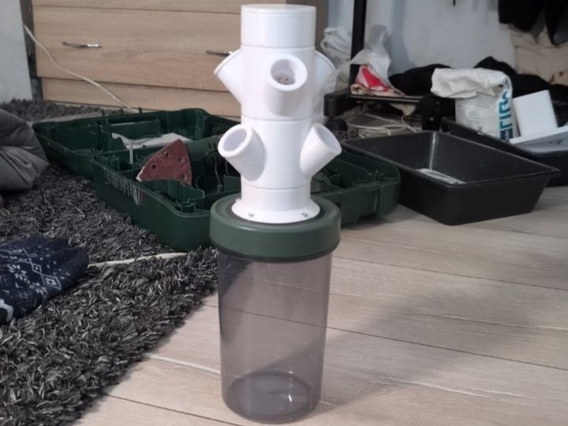

# Hydroponic Tower

A PlatformIO-based embedded system for controlling an automated hydroponic watering tower using a WeMos D1 Mini microcontroller with Telegram bot integration.



## Features

- **Automatic Watering Control**: Configurable on/off timings for the pump
- **Telegram Bot Interface**: Remote control and monitoring via Telegram
- **Manual Override**: Ability to manually turn the pump on/off or set it to automatic mode
- **Status Monitoring**: Real-time status updates and system information
- **Persistent Configuration**: Stores watering timings in EEPROM
- **Logging System**: Comprehensive logging with multiple output options
- **OTA Updates**: Over-the-air firmware updates support

## Hardware Requirements

- WeMos D1 Mini (ESP8266)
- Relay module (for pump control)
- Water pump
- Power supply (5V for logic, appropriate voltage for pump)
- Sensors (optional, for future enhancements)

## Pin Configuration

| Pin | Function |
|-----|----------|
| D1 (GPIO5) | Pump Relay Control |

## Project Structure

```
├── src/
│   ├── config.h           # Configuration settings (WiFi, timings, Telegram token)
│   ├── main.cpp/h         # Main application logic
│   ├── wifi_drv.cpp/h     # WiFi driver
│   ├── ota_drv.cpp/h      # OTA (Over-The-Air) update driver
│   ├── tg_bot.cpp/h       # Telegram bot handler
│   ├── pump_drv.cpp/h     # Pump control driver
│   ├── log/               # Logging system
│   ├── utils/             # Utility functions
│   ├── vocabulary/        # String constants and messages
│   └── hydro_port/        # Hardware abstraction layer
├── include/               # Public headers (if needed)
├── lib/                   # Libraries
├── test/                  # Test code
└── platformio.ini         # PlatformIO configuration
```

## Configuration

### WiFi Settings
Edit `src/config.h` to set your WiFi credentials:
```c
#define NCFG_WIFI_SSID       "Your_SSID"
#define NCFG_WIFI_PASS       "Your_Password"
```

### Telegram Bot Setup
1. Create a new bot with @BotFather on Telegram
2. Get your Chat ID using @userinfobot
3. Update `config.h`:
```c
#define NCFG_TG_BOT_TOKEN    "your_bot_token"
#define NCFG_TG_CHAT_ID      "your_chat_id"
```

### Watering Timings
Configure pump on/off durations in `config.h`:
```c
#define NCFG_DEFAULT_PUMP_ON_MS      (1 * 60 * 1000UL)  // Minutes ON
#define NCFG_DEFAULT_PUMP_OFF_MS     (1 * 60 * 1000UL)  // Minutes OFF
```

## Building and Uploading

### Prerequisites
- PlatformIO IDE or CLI installed
- USB driver for WeMos D1 Mini

### Build
```bash
platformio run
```

### Upload
```bash
platformio run --target upload
```

### Serial Monitor
```bash
platformio device monitor --baud 115200
```

## Telegram Bot Commands

- **🟢 AUTO** - Switch to automatic mode
- **💧 TURN ON** - Manually turn pump on
- **🛑 TURN OFF** - Manually turn pump off
- **ℹ️ STATUS** - Get current pump status
- **⚙️ Configure timers** - Set custom on/off timings

## Logging

The system includes a configurable logging system:
- **Log Level**: Set in `config.h` (`NCFG_LOG_LEVEL`)
- **Output**: Serial port (UART at 115200 baud)
- **Format**: `[TAG]-TS-C#-Type-Message-LineNum`

## Troubleshooting

### WiFi Connection Issues
- Verify SSID and password in `config.h`
- Check WiFi signal strength
- Restart the device

### Telegram Bot Not Responding
- Verify bot token and chat ID
- Ensure device has internet connection
- Check Telegram API status

### Pump Not Responding
- Verify relay pin configuration
- Check relay module connections
- Ensure power supply to relay

## Future Enhancements

- Add soil moisture sensor support
- Implement data logging to cloud
- Add mobile app for better UI
- Support multiple zones/pumps
- Add weather-based watering

## License

This project is provided as-is for personal use. All rights reserved.

## Contact

For questions or issues, please open an issue on GitHub.

---

**Note**: Do not share your WiFi credentials, Telegram bot token, or Chat ID. Keep `config.h` private!
